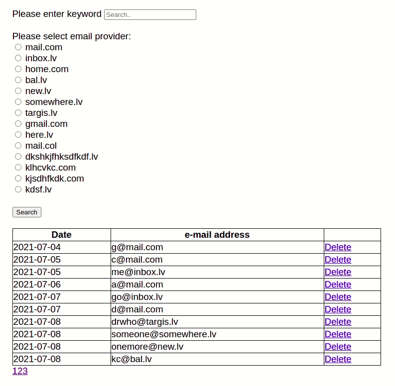

# Web Developer Test 

This project is a finished test for Magebit company, for applying to Junior Web Developers position.

### Languages and libraries  I used:

* HTML
* CSS, SASS
* PHP OOP
* JavaScript
* JQuery
* MySQL

## Short description:

* **index.php**, **table.php** and **list.php** files are main files.
* **subscribed.sql** MariaDB is a sql export file.
* **classes** folder:
  * **Database.php** file is a file for Database class that contains basic properties and methods for interacting with a database.
  * **Email.php** file contains the class for holding functions and logic for interactions with table data.
  * **Providers.php** file contains class for holding functions and logic for filtering by provider option.
  * **Validation.php** file contains the class for forms validation.
* **images** folder contains all images that are used in this project.  
* **includes** folder:
    * **config.php** file is a database configuration file.
  * **autoloader.php** file is holding function that automatically loads classes into main pages.
* **scripts** folder: 
  * **searchByKeyWord.js** file contains jQuery functions for searching by key word option.
  * **sorttable.js** file contains functions for sorting table rows by date or A-Z. This page is not written by me, but the code does what I need, so I decided to use it.
  * **validation.js** file contains function for forms validation.
* **styles** folder contains all scss and css files.

### Final outcome of index.php

### Final outcome of list.php
